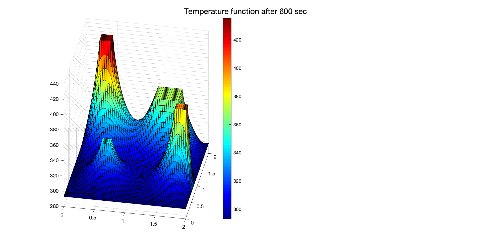
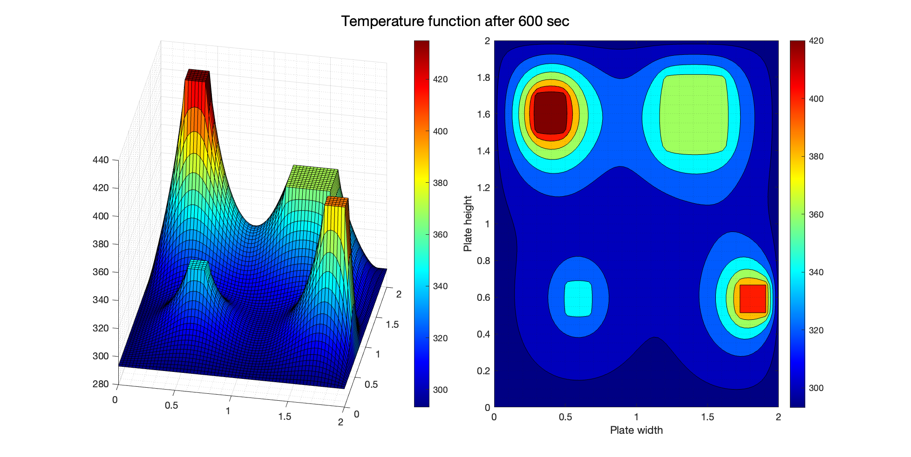

# Thermal Simulation and Analysis (TSA)
## (TSA initialise)
Thermal Simulation and Analysis (TSA) is preliminary package that offers an insight on the diffusivity of thermal conduction through user defined boundary conditions and heat source. 

> [!IMPORTANT]  
> The C++ version of TSA is still under debug phase and will be released after the problems are resolved.

```
TITLE INPUT.txt

MODE  thermal
MODEL 
        NAME    FS9
        L       2.0
        W       2.0
        alpha   9.7e-5
        
END
BC
        T_init    393.15
        BC1      [0.4, 0.4, 700]
        BC2      [0.8, 0.3, 510]
        BC3      [0.7, 0.7, 620]     
        BC4      [0.1, 0.1, 800] 
        BC5      [0.9, 0.8, 1000]   
        BC6      [0.5, 0.5, 1200]
        BC7      [0.2, 0.7, 800]
END

SETTINGS
        simT    180
        dt      0.1
        dL      0.05
        dW      0.05
        option  'instant'
END
```

# Results 
<p align="center">
  
  
</p>


> [!IMPORTANT]  
> This is still an on-going work as more feature will be added into TSA in future releases. 
