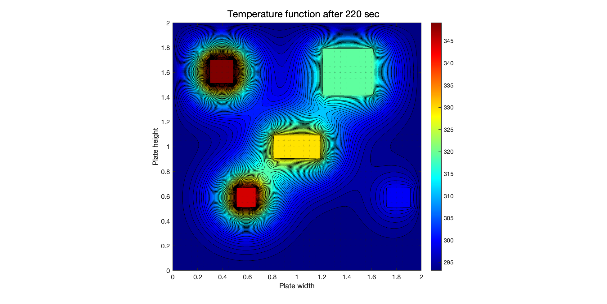

# Thermal Simulation and Analysis (TSA)
## (TSA initialise)
Thermal Simulation and Analysis (TSA) is preliminary package that offers an insight on the diffusivity of thermal conduction through user defined boundary conditions and heat source. 

> [!IMPORTANT]  
> The C++ version of TSA is still under debug phase and will be released after the problems are resolved.

```
TITLE INPUT.txt

MODE  thermal
MODEL 
        NAME    FS9
        L       2.0
        W       2.0
        thick   0.2
        alpha   9.7e-5
        k       237
        
END
BC
        T_0       293.15
        BC1      [0.7, 0.8, 0.2, 0.2, 0.01, 405, 15]
        BC2      [0.3, 0.3, 0.1, 0.1, 0.01, 345, 15]
        BC3      [0.9, 0.3, 0.1, 0.1, 0.01, 400, 15]
        BC4      [0.2, 0.8, 0.1, 0.1, 0.01, 350, 15]
        BC5      [0.5, 0.5, 0.2, 0.1, 0.01, 370, 15]

END

SETTINGS
        simT    220
        dt      0.1
        dL      0.01
        dW      0.01
        option  ''
END
```

$$\frac{\partial^2 T}{\partial x^2} + \frac{\partial^2 T}{\partial y^2} + \frac{\partial^2 T}{\partial z^2} = \nabla^2 T $$

# Results 
<p align="center">
  
</p>


> [!IMPORTANT]  
> This is still an on-going work as more feature will be added into TSA in future releases. 
